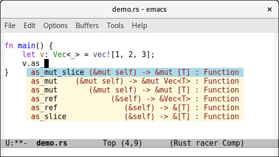

# Emacs Racer Mode
[](http://melpa.org/#/company-racer)
[](http://stable.melpa.org/#/company-racer)

This package allows emacs to use [Racer](http://github.com/phildawes/racer) for Rust code completion and navigation.



## Installation

1. Build / Install [Racer](http://github.com/phildawes/racer)

1. Install emacs 24.

2. Allow Emacs to install packages from MELPA:

   ```el
   (require 'package)
   (add-to-list 'package-archives '("melpa" . "https://melpa.org/packages/"))
   ```

2. Install racer: `M-x package-list` Find the racer package and install it

3. If racer is not in the path, configure emacs to find your racer binary and rust source directory
   ```el
   (setq racer-cmd "<path-to-racer-srcdir>/target/release/racer")
   (setq racer-rust-src-path "<path-to-rust-srcdir>/src/")
   ```

4. Configure Emacs to activate racer when rust-mode starts:
   ```el
   (add-hook 'rust-mode-hook #'racer-mode)
   (add-hook 'racer-mode-hook #'eldoc-mode)
   ```

   For completions, install company with `M-x package-install RET company`. A sample configuration:
   ```el

   (add-hook 'racer-mode-hook #'company-mode)

   (global-set-key (kbd "TAB") #'company-indent-or-complete-common) ;
   (setq company-tooltip-align-annotations t)
   ```
   For automatic completions, customize `company-idle-delay` and `company-minimum-prefix-length`.

5. Open a rust file and try typing ```use std::io::B``` and press `<tab>`

6. Place your cursor over a symbol and hit `M-.` to jump to the
definition.

7. Hit `M-,` to jump back to the symbol usage location.
