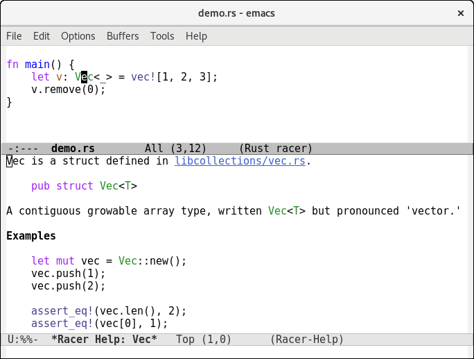

# Racer for Emacs
[](http://melpa.org/#/racer)
[](http://stable.melpa.org/#/racer)

This is the official Emacs package for
[Racer](http://github.com/phildawes/racer).

<!-- markdown-toc start - Don't edit this section. Run M-x markdown-toc-generate-toc again -->
**Table of Contents**

- [Racer for Emacs](#racer-for-emacs)
    - [Completion](#completion)
    - [Find Definitions](#find-definitions)
    - [Describe Functions and Types](#describe-functions-and-types)
    - [Installation](#installation)
    - [Tests](#tests)

<!-- markdown-toc end -->

## Completion

racer.el supports code completion of variables, functions and modules.


You can also press <kbd>F1</kbd> to pop up a help buffer for the current
completion candidate.

Note that due to a
[limitation of racer](https://github.com/phildawes/racer/issues/389),
racer.el cannot offer completion for macros.

## Find Definitions

racer.el can jump to definition of functions and types.


You can use <kbd>M-.</kbd> to go to the definition, and <kbd>M-,</kbd>
to go back.

## Describe Functions and Types

racer.el can show a help buffer based on the docstring of the thing at
point.



Use <kbd>M-x racer-describe</kbd> to open the help buffer.

## Installation

1. Install [Racer](http://github.com/phildawes/racer):

   ```
   $ cargo install racer
   ```

2. Allow Emacs to install packages from MELPA:

   ```el
   (require 'package)
   (add-to-list 'package-archives '("melpa" . "https://melpa.org/packages/"))
   ```

2. Install racer: `M-x package-install RET racer RET`

3. Download the [rust sourcecode](https://www.rust-lang.org/en-US/downloads.html),
   and configure emacs to find your rust source directory:
   
   ```el
   (setq racer-rust-src-path "<path-to-rust-srcdir>/src/")
   ```

4. Configure Emacs to activate racer when rust-mode starts:
   ```el
   (add-hook 'rust-mode-hook #'racer-mode)
   (add-hook 'racer-mode-hook #'eldoc-mode)
   ```

   For completions, install company with `M-x package-install RET company RET`. A sample configuration:
   ```el

   (add-hook 'racer-mode-hook #'company-mode)

   (define-key rust-mode-map (kbd "TAB") #'company-indent-or-complete-common)
   (setq company-tooltip-align-annotations t)
   ```
   For automatic completions, customize `company-idle-delay` and `company-minimum-prefix-length`.

5. Open a rust file and try typing ```use std::io::B``` and press <kbd>TAB</kbd>.

6. Place your cursor over a symbol and hit `M-.` to jump to the
definition.

7. Hit `M-,` to jump back to the symbol usage location.

## Tests

racer.el includes tests. To run them, you need to install
[Cask](https://github.com/cask/cask), then:

```
$ cask install
$ cask exec ert-runner
```
